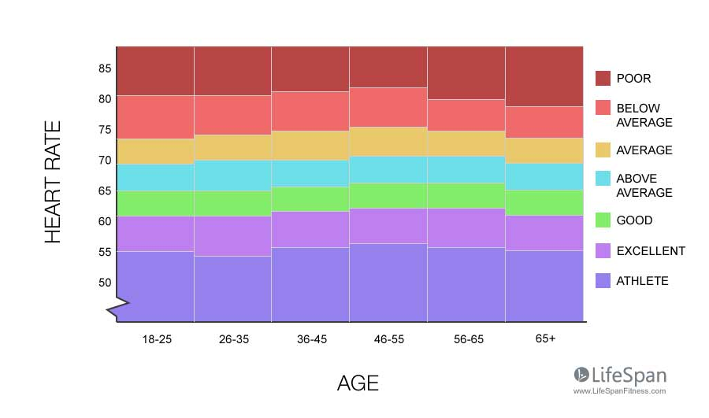

# Project Overview

This project has 2 main parts:

- [Part 1](#part-1-pulse-rate-algorithm-overview) - Develop a **Pulse Rate Algorithm** on the given training data. Then **Test Your Algorithm** and see that it has met the success criteria.
- [Part 2](#part-2-clinical-application-overview) - Apply the Pulse Rate Algorithm on a **Clinical Application** and compute more clinically meaningful features and discover healthcare trends.

Let's start with some background.

-----

## Part 1: Pulse Rate Algorithm Overview

## Algorithm Specifications

  * estimates pulse rate from the PPG signal and a 3-axis accelerometer.
  * assumes pulse rate will be restricted between 40BPM (beats per minute) and 240BPM
  * produces an estimation confidence. A higher confidence value means that this estimate should be more accurate than an estimate with a lower confidence value.
  * produces an output at least every 2 seconds.  

### Success Criteria
The algorithm performance success criteria is as follows: the mean absolute error at 90% availability must be less than 15 BPM on the test set. Put another way, the best 90% of the estimates--according to the own confidence output-- must have a mean absolute error of less than 15 BPM. The evaluation function is included in the starter code.

Note that the unit test will call `AggregateErrorMetric` on the output of the `RunPulseRateAlgorithm` on a test dataset that we do not have access to. The result of this call must be less than 15 BPM for the algorithm's performance to pass. The test set should be easier than the training set so as long as the algorithm is doing reasonably well on the training data set it should pass this test.

**This will be validated through the Test the Algorithm Workspace which includes a unit test.**

### Dataset
Troika1 dataset

1. **Troika** - Zhilin Zhang, Zhouyue Pi, Benyuan Liu, ‘‘TROIKA: A General Framework for Heart Rate Monitoring Using Wrist-Type Photoplethysmographic Signals During Intensive Physical Exercise,’’IEEE Trans. on Biomedical Engineering, vol. 62, no. 2, pp. 522-531, February 2015. Link

### Some Helpful Tips
  1. Remember to bandpass filter all the signals. Use the 40-240BPM range to create the pass band.
  2. Use plt.specgram to visualize the signals in the frequency domain. We can plot the estimates on top of the spectrogram to see where things are going wrong.
  3. When the dominant accelerometer frequency is the same as the PPG, try picking the next strongest PPG frequency if there is another good candidate.
  4. Sometimes the cadence of the arm swing is the same as the heart beat. So if we can't find another good candidate pulse rate outside of the accelerometer peak, it may be the same as the accelerometer.
  5. One option for a confidence algorithm is to answer the question, "How much energy in the frequency spectrum is concentrated near the pulse rate estimate?" We can answer this by summing frequency spectrum near the pulse rate estimate and dividing it by the sum of the entire spectrum.

-----
## Part 2: Clinical Application Overview

We can use the result of part 1 to compute more clinically meaningful features and discover healthcare trends.

Specifically, we will use 24 hours of heart rate data from 1500 samples to try to validate the well known trend that average resting heart rate increases up until middle age and then decreases into old age. We'll also see if resting heart rates are higher for women than men. See the trend illustrated in this image:

### Dataset (CAST)

The data from this project comes from the [Cardiac Arrythmia Suppression Trial (CAST)](https://physionet.org/content/crisdb/1.0.0/), which was sponsored by the National Heart, Lung, and Blood Institute (NHLBI). CAST collected 24 hours of heart rate data from ECGs from people who have had a myocardial infarction (MI) within the past two years.2 This data has been smoothed and resampled to more closely resemble PPG-derived pulse rate data from a wrist wearable.3

-----
## Citations
1. **Troika** - Zhilin Zhang, Zhouyue Pi, Benyuan Liu, ‘‘TROIKA: A General Framework for Heart Rate Monitoring Using Wrist-Type Photoplethysmographic Signals During Intensive Physical Exercise,’’IEEE Trans. on Biomedical Engineering, vol. 62, no. 2, pp. 522-531, February 2015. Link
2. **CAST RR Interval Sub-Study Database Citation** - Stein PK, Domitrovich PP, Kleiger RE, Schechtman KB, Rottman JN. Clinical and demographic determinants of heart rate variability in patients post myocardial infarction: insights from the Cardiac Arrhythmia Suppression Trial (CAST). Clin Cardiol 23(3):187-94; 2000 (Mar)
3. **Physionet Citation** - Goldberger AL, Amaral LAN, Glass L, Hausdorff JM, Ivanov PCh, Mark RG, Mietus JE, Moody GB, Peng C-K, Stanley HE. PhysioBank, PhysioToolkit, and PhysioNet: Components of a New Research Resource for Complex Physiologic Signals (2003). Circulation. 101(23):e215-e220.
